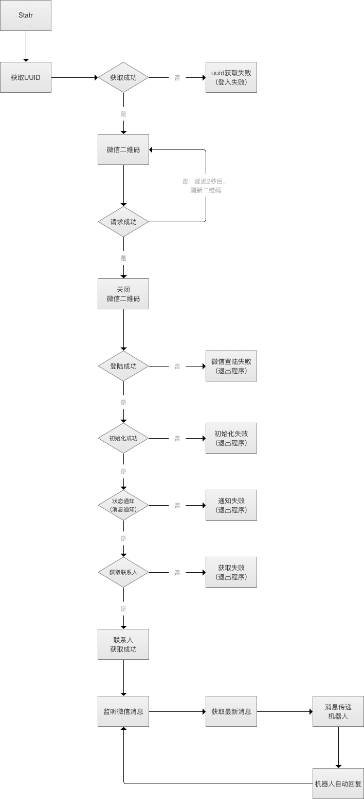

# squirrelAI

## 项目说明

----
<table>

<tr>
<td>产品名称：</td>
<td>松鼠AI</td>
<td>版本：</td>
<td>V 2.2</td>
</tr>

<tr>
<td>作者：</td>
<td>张益斌</td>
<td>更新日期：</td>
<td>2018/10/13</td>
</tr>

</table>

#### 一、制作背景

在这Im泛滥的年代，人与人之间的沟通变的越来越便利，属于自己的时间和空间也变的越来越少。每天忙碌的为工作、生活奔波，同时还要花大量的精力处理来自不同场景下的消息。 
你是否会想停下脚步一个人静静地呆上一会，没有电话没有消息，好好感受一下“世界属于我的瞬间”。 
微信已然成为中国用户生活中不可或缺的一部分；最大的优势在与点对点的即时通讯方式，拉近了人与人之间的距离。然而，这种便利也带来了新的恐惧“社交恐惧”。 
松鼠ＡＩ，就是一个可以帮助你处理大多数你认为不重要，但又不失“礼貌”的消息回复；而且通过“图灵机器人”的技术提供，它还可以给予你生活中更多的陪伴。 

#### 二、捐赠感谢

您要是觉得"松鼠Ai"是一个有意思的程序；并且有捐赠意向的同学，请捐赠到: 
1.支付宝账号：13067760265  
2.微信号码：zhyblx 
3.招商银行卡号：6214 8557 1279 0845 
4.平安银行卡号：623058 000018 3696983 

对捐赠的个人和公司表示感谢：
<table>

<tr>
<td>捐赠时间</td>
<td>公司(/个人)名称</td>
<td>捐赠金额</td>
</tr>

<tr>
<td>2018-12-15</td>
<td>杭州佳好佳美居装饰材料商城芝阑装饰材料商行</td>
<td>¥500.0</td>
</tr>

</table>

#### 三、流程设计

#### 四、接口说明

松鼠AI项目整体分为两层：功能层和使用层。 

*功能层： 

功能层整体分为三部分进行设计foundation(基础层)、application(应用层)、aifunction(AI功能层)。 

a)foundation(基础层):
<table>
<tr>
<td>功能</td>
<td>包</td>
<td>类</td>
<td>方法</td>
<td>参数</td>
<td>返回类型</td>
<td>描述</td>
</tr>
    
<tr>
<td>接口定义</td>
<td>com.zhangyibin.foundation.wechatinterface;</td>
<td>WechatInterface</td>
<td>/</td>
<td>/</td>
<td>/</td>
<td>定义常量</td>
</tr>
    
<tr>
<td>获取UUID</td>
<td>com.zhangyibin.foundation.wechatapp;</td>
<td>WechatApp</td>
<td>getUUID()</td>
<td>/</td>
<td>String</td>
<td>微信登录的唯一识别信息</td>
</tr>

<tr>
<td>登录二维码</td>
<td>com.zhangyibin.foundation.wechatapp;</td>
<td>WechatApp</td>
<td>showQrCode()</td>
<td>/</td>
<td>/</td>
<td>获取登录二维码</td>
</tr>

<tr>
<td>展示二维码</td>
<td>com.zhangyibin.foundation.wechatapp;</td>
<td>QRCodeFrame</td>
<td>QRCodeFrame()</td>
<td>filePath:二维码图片地址</td>
<td>/</td>
<td>二维码通过窗体展示</td>
</tr>

<tr>
<td>登录等待</td>
<td>com.zhangyibin.foundation.wechatapp;</td>
<td>WechatApp</td>
<td>waitForLogin() ()</td>
<td>/</td>
<td>/</td>
<td>扫描二维码登录验证</td>
</tr>

<tr>
<td>登录等待</td>
<td>com.zhangyibin.foundation.wechatapp;</td>
<td>WechatApp</td>
<td>login()</td>
<td>/</td>
<td>boolean</td>
<td>登录成功返回true</td>
</tr>

<tr>
<td>初始化</td>
<td>com.zhangyibin.foundation.wechatapp;</td>
<td>WechatApp</td>
<td>wxInit()</td>
<td>/</td>
<td>boolean</td>
<td>初始化异常：返回false;作用于验证账号是否为微信黑名单</td>
</tr>

<tr>
<td>状态通知</td>
<td>com.zhangyibin.foundation.wechatapp;</td>
<td>WechatApp</td>
<td>wxStatusNotify()</td>
<td>/</td>
<td>boolean</td>
<td>状态通知监控异常：返回false;</td>
</tr>

<tr>
<td>获取好友列表</td>
<td>com.zhangyibin.foundation.wechatapp;</td>
<td>WechatApp</td>
<td>getContact()</td>
<td>/</td>
<td>boolean</td>
<td>好友列表获取失败:返回false;</td>
</tr>

<tr>
<td>监控消息</td>
<td>com.zhangyibin.foundation.wechatapp;</td>
<td>WechatApp</td>
<td>syncCheck()</td>
<td>/</td>
<td>int</td>
<td>作用于是否获取到好友消息内容</td>
</tr>

<tr>
<td>发送消息</td>
<td>com.zhangyibin.foundation.wechatapp;</td>
<td>WechatApp</td>
<td>webwxsendmsg()</td>
<td>
String content:消息内容
String to：接收好友
</td>
<td>/</td>
<td>处理消息发送</td>
</tr>

<tr>
<td>最新消息</td>
<td>com.zhangyibin.foundation.wechatapp;</td>
<td>WechatApp</td>
<td>webwxsync()</td>
<td>/</td>
<td>JSON</td>
<td>获取消息内容</td>
</tr>

<tr>
<td>回复消息</td>
<td>com.zhangyibin.foundation.wechatapp;</td>
<td>WechatApp</td>
<td>handleMsg()</td>
<td>JSONObject data:消息内容</td>
<td>/</td>
<td>实现给予好友消息回复</td>
</tr>

<tr>
<td>用户备注名</td>
<td>com.zhangyibin.foundation.wechatapp;</td>
<td>WechatApp</td>
<td>getUserRemarkName()</td>
<td>String id:微信ID</td>
<td>String</td>
<td>获取到好友备注名称</td>
</tr>

<tr>
<td>监听程序</td>
<td>com.zhangyibin.foundation.wechatapp;</td>
<td>WechatApp</td>
<td>listenMsgMode()</td>
<td>/</td>
<td>/</td>
<td>保持网络连接</td>
</tr>

<tr>
<td>好友通讯录</td>
<td>com.zhangyibin.foundation.util;</td>
<td>AddressBook</td>
<td>getAddressBookList()</td>
<td>JSONObject jsonObject:好友列表JSON</td>
<td>/</td>
<td>
1.获取好友列表 
2.新好友插入到数据库中
</td>
</tr>

<tr>
<td>Cookie信息</td>
<td>com.zhangyibin.foundation.util;</td>
<td>CookieUtil</td>
<td>getCookie()</td>
<td>HttpRequest request:Http请求</td>
<td>String</td>
<td>模拟浏览器Cookie信息</td>
</tr>

<tr>
<td>匹配器</td>
<td>com.zhangyibin.foundation.util;</td>
<td>Matchers</td>
<td>match()</td>
<td>
String p :正则表达
String str：匹配字符串
</td>
<td>String</td>
<td>用于处理登陆微信过程的正则表达式的处理</td>
</tr>

<tr>
<td>连接(创建)数据库</td>
<td>com.zhangyibin.foundation.databaseservice;</td>
<td>CreateSQLiteService</td>
<td>main()</td>
<td>/</td>
<td>/</td>
<td>连接(创建)数据库</td>
</tr>

<tr>
<td>message数据插入库</td>
<td>com.zhangyibin.foundation.databaseservice;</td>
<td>InsertService</td>
<td>getInsertService()</td>
<td>
String date:日期
String name：用户名
String message：消息内容
</td>
<td>/</td>
<td>消息插入数据库</td>
</tr>

<tr>
<td>message数据插入库</td>
<td>com.zhangyibin.foundation.databaseservice;</td>
<td>InsertService</td>
<td>getInsertService()</td>
<td>
String strSql:完整的SQL语句
</td>
<td>/</td>
<td>消息插入数据库</td>
</tr>

<tr>
<td>查询服务</td>
<td>com.zhangyibin.foundation.databaseservice;</td>
<td>SelectService</td>
<td>getSelectService()</td>
<td>
String sql:完整的select语句
</td>
<td>/</td>
<td>数据查询</td>
</tr>

</table>

b)application(应用层):

<table>
<tr>
<td>功能</td>
<td>包</td>
<td>类</td>
<td>方法</td>
<td>参数</td>
<td>返回类型</td>
<td>描述</td>
</tr>

<tr>
<td>特殊账号枚举</td>
<td>com.zhangyibin.application.specialusers;</td>
<td>SpecialUsersEnum</td>
<td>getNameList()</td>
<td>/</td>
<td>String</td>
<td>账号枚举列表类(不回复消息名单)</td>
</tr>

<tr>
<td>枚举值转化成List</td>
<td>com.zhangyibin.application.speciauserslist;</td>
<td>SpecialUsersList</td>
<td>getSpecialUsersList()</td>
<td>/</td>
<td>List<String></td>
<td>账号枚举列表类(不回复消息名单)</td>
</tr>

<tr>
<td>启动程序入口</td>
<td>com.zhangyibin.application;</td>
<td>StartWechatApp</td>
<td>GETStartWechatApp</td>
<td>/</td>
<td>/</td>
<td>执行程序主入口</td>
</tr>

</table>

c)aifunction(AI功能层):

<table>
<tr>
<td>功能</td>
<td>包</td>
<td>类</td>
<td>方法</td>
<td>参数</td>
<td>返回类型</td>
<td>描述</td>
</tr>

<tr>
<td>机器人调用</td>
<td>com.zhangyibin.aifunction;</td>
<td>SquirrelAiRobot</td>
<td>SquirrelRobot()</td>
<td>String msg:消息内容</td>
<td>String</td>
<td>调用图灵机器人接口(不回复消息名单)</td>
</tr>

</table>

*使用层： 

使用层整体分为两部分进行设计test(测试)、use(使用层)。 

<table>
<tr>
<td>功能</td>
<td>包</td>
<td>类</td>
<td>方法</td>
<td>参数</td>
<td>返回类型</td>
<td>描述</td>
</tr>

<tr>
<td>测试代码</td>
<td>com.squirrelAi.test;</td>
<td>/</td>
<td>/</td>
<td>/</td>
<td>/</td>
<td>工程测试代码</td>
</tr>

<tr>
<td>启动松鼠AI</td>
<td>com.squirrelAi.use;</td>
<td>UseSquirrelAi</td>
<td>main</td>
<td>/</td>
<td>/</td>
<td>启动松鼠AI,调用StartWechatApp功能</td>
</tr>

</table>

#### 四、版本管理

<table>

<tr>
<td>日期</td>
<td>版本号</td>
<td>更新内容</td>
<td>备注</td>
</tr>

<tr>
<td>2018.06.18</td>
<td>V1.0</td>
<td>
功能上线
</td>
<td>web框架：blade-kit-1.2.9-alpha.jar</td>
</tr>

<tr>
<td>2018.08.03</td>
<td>V1.1</td>
<td>

a)基础部分： 
实现仿制web微信通过扫描客户端二维码进行登陆。 
实现IOS设备可正常登陆。 
实现获取微信通讯录的联系人。 
实现监听微信联系人的消息。 
实现可回复好友消息。 

b)会话功能： 
实现接入机器人回复好友消息。 
实现屏蔽回复好友消息的黑名单功能。 
黑名单功能包括屏蔽好友个人、聊天群以及公众号消息。 
实现关闭机器人自动回复消息，可转人工回复好友消息。 

c)拓展功能： 
实现保存聊天消息在本地。 
实现测试程序打包，调试可桌面运行。 

</td>
<td>web框架：blade-kit-1.2.9-alpha.jar</td>
</tr>

<tr>
<td>2018.08.16</td>
<td>V1.2</td>
<td>
增加白名单功能，以实现区分重要好友提供人工回复的消息的方式，非重要好友提供机器人回复消息的方式。 
</td>
<td>web框架：blade-kit-1.2.9-alpha.jar</td>
</tr>

<tr>
<td>2018.09.28</td>
<td>V2.0</td>
<td> 更换JDK11  </td>
<td>web框架：blade-kit-1.2.9-alpha.jar</td>
</tr>

<tr>
<td>2018.10.12</td>
<td>V2.1</td>
<td> 
1.项目更名：松鼠AI。  
2.代码重构；功能层划分为三部分基础层、应用层、AI功能层。 
3.接入数据库服务,完成消息存储。 
4.更换web框架：blade-kit-1.3.4.jar

</td>
<td>
1.web框架：blade-kit-1.3.4.jar 
2.JDBC：sqlite-jdbc-3.21.0.jar 
</td>
</tr>

<tr>
<td>2018.10.28</td>
<td>V2.2</td>
<td> 
更新内容： 
实现将新好友添加到数据库中。
</td>
<td>
--
</td>
</tr>

</table>

本地备份：/home/zhangyibin/文档/松鼠AI备份列表

